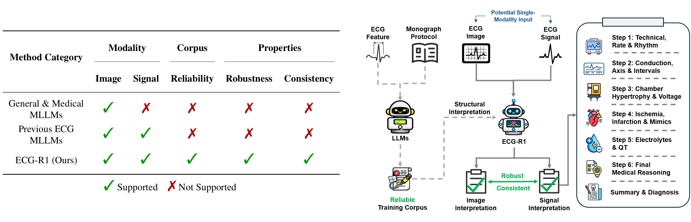
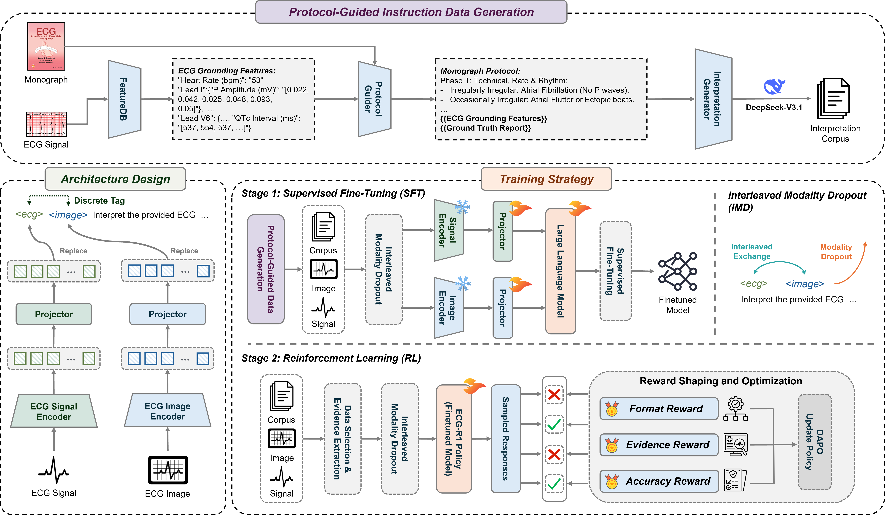

<div align="center">

<h1> ECG-R1: Protocol-Guided and Modality-Agnostic MLLM for Reliable ECG Interpretation </h1>

<h5 align="center"> If you find this project useful, please give us a star🌟.

<h5 align="center"> 

<!-- <a href='https://www.lanxplanet.com/GEM-ECG/'></a> -->
<a href='https://arxiv.org/pdf/2503.06073'></a>
<a href='https://huggingface.co/PKUDigitalHealth/ECG-R1-8B-RL'>
<a href='https://huggingface.co/datasets/PKUDigitalHealth/ECG-Protocol-Guided-Grounding-CoT'>

<p align="center">
  Jiarui Jin, Haoyu Wang, Xingliang Wu, Xiaocheng Fang, Xiang Lan, Zihan Wang<br/>
  Deyun Zhang, Bo Liu, Yingying Zhang, Xian Wu, Hongyan Li, Shenda Hong
</p>


<p align="center">
    
</p>

</h5>
</div>

## Introduction

Electrocardiography (ECG) serves as an indispensable diagnostic tool in clinical practice, yet existing multimodal large language models (MLLMs) remain unreliable for ECG interpretation, often producing plausible but clinically incorrect analyses. To address this, we propose ECG-R1, the first reasoning MLLM designed for reliable ECG interpretation via three innovations. First, we construct the interpretation corpus using Protocol-Guided Instruction Data Generation, grounding interpretation in measurable ECG features and monograph-defined quantitative thresholds and diagnostic logic. Second, we present a modality-decoupled architecture with Interleaved Modality Dropout to improve robustness and cross-modal consistency when either the ECG signal or ECG image is missing. Third, we present Reinforcement Learning with ECG Diagnostic Evidence Rewards to strengthen evidence-grounded ECG interpretation. Additionally, we systematically evaluate the ECG interpretation capabilities of proprietary, open-source, and medical MLLMs, and provide the first quantitative evidence that severe hallucinations are widespread, suggesting that the public should not directly trust these outputs without independent verification.  Code and data are publicly available at [Github](https://github.com/PKUDigitalHealth/ECG-R1) and [HuggingFace](https://huggingface.co/datasets/PKUDigitalHealth/ECG-Protocol-Guided-Grounding-CoT), and an online platform can be accessed at [ECG-R1-Online-Platform](http://ai.heartvoice.com.cn/ECG-R1/).

## 🔥Updates

- **[Feb 2026]** ECG-R1 Online Platform is now available, try it in  https://ai.heartvoice.com.cn/ECG-R1 !
- **[Feb 2026]** [ECG-R1-8B](https://huggingface.co/PKUDigitalHealth/ECG-R1-8B-RL) and [ECG-Protocol-Guided-Grounding-CoT-30k](https://huggingface.co/datasets/PKUDigitalHealth/ECG-Protocol-Guided-Grounding-CoT) are now available. 

*Stay tuned for updates!*

## Resource


#### Paper: 📄 [Arxiv](https://arxiv.org/pdf/2602.04279)

#### Model: 🤗 [ECG-R1-8B](https://huggingface.co/PKUDigitalHealth/ECG-R1-8B-RL)

#### Data: 🤗 [ECG-Protocol-Guided-Grounding-CoT](https://huggingface.co/datasets/PKUDigitalHealth/ECG-Protocol-Guided-Grounding-CoT)

## Setup

```shell
git clone https://github.com/PKUDigitalHealth/ECG-R1
cd ECG-R1
conda create -n ecg_r1 python=3.10 -y
conda activate ecg_r1
pip install -e .
pip install -r requirements.txt
pip install -e ./ecg_r1  # ECG-R1 vLLM support
```

## Data Preparation

Please download required data:

ECG:  
- [MIMIC-IV](https://physionet.org/content/mimic-iv-ecg/1.0/)
- [PTB-XL](https://physionet.org/content/ptb-xl/1.0.3/)
- [Code-15%](https://zenodo.org/records/4916206)
- [CPSC 2018](https://physionet.org/content/challenge-2020/1.0.2/training/cpsc_2018/)
- [CSN](https://physionet.org/content/ecg-arrhythmia/1.0.0/)
- [G12E](https://physionet.org/content/challenge-2020/1.0.2/training/georgia/)

Images:
- [ECG-Grounding-Images](https://huggingface.co/datasets/LANSG/ECG-Grounding) (mimic_gen)
- [ECG-Instruct](https://huggingface.co/datasets/PULSE-ECG/ECGInstruct/tree/main)
- [ECG-Bench](https://huggingface.co/datasets/PULSE-ECG/ECGBench)

After downloading all of them, organize the data as follows in `./data`,

```
├── ecg_timeseries
    └── champan-shaoxing
    └── code15
    └── cpsc2018
    └── ptbxl
    └── georgia
    └── mimic-iv
├── ecg_images
    └── cod15_v4
    └── csn_aug_all_layout_papersize
    └── csn_ori_layout_papersize
    └── csn_part_noise_layout_papersize
    └── gen_images
      └── mimic_gen
    └── mimic
    └── mimic_v4
    └── ptb-xl
├── ecg_bench
    ├── ptb-test.jsonl
    ├── cpsc-test.jsonl
    ├── code15-test.jsonl
    ├── csn-test-no-cot.jsonl
    └── g12-test-no-cot.jsonl
├── ecg_jsons
    ├── train_set
    │   ├── ECG-Protocol-Guided-Grounding-CoT-30k.jsonl
    │   ├── ECG-Protocol-Guided-Grounding-CoT-RL-4k.jsonl
    │   └── ECGInstruct.jsonl
    └── test_set
        ├── ecg-grounding-test-mimiciv_full.jsonl
        ├── ecg-grounding-test-mimiciv_ecg_missing25.jsonl
        ├── ...
        ├── ecg-grounding-test-mimiciv_image_missing25.jsonl
        └── ...

```

## Pretrained Model Preparation

Pretrained ECG Encoder:
  - [ECG-CoCa](https://drive.google.com/drive/folders/1-0lRJy7PAMZ7bflbOszwhy3_ZwfTlGYB?usp=sharing) : download ```cpt_wfep_epoch_20.pt```, place it in ```ecg_coca/open_clip/checkpoint```


## Train

<p align="center">
    
</p>

For SFT training from scratch:
  - step 1. specify paths in ```scripts/shells/sft_train.sh```
  - step 2. run ```bash scripts/shells/sft_train.sh```

For RL training from scratch:
  - step 1. specify paths in ```scripts/shells/rl_train_rollout.sh``` and ```scripts/shells/rl_train_dapo.sh```
  - step 2. make sure you have installed ecg-r1 vllm support
  - step 3. run ```scripts/shells/rl_train_rollout.sh```
  - step 4. run ```scripts/shells/rl_train_dapo.sh```

## Evaluation

For ECG Interpretation:
  - step 1. generate interpretations: ```scripts/shells/inference.sh```
  - step 2. generate evaluation reports: ```scripts/evaluation/grounded_interpretation/generate_volcengine_evaluation_result_batch.py```
  - step 3. process evaluation reports and get scores: ```scripts/evaluation/grounded_interpretation/compute_metrics.py```

For Modality Missing:
  - step 1. generate image-only ECG interpretation by setting ```--val_dataset```  to ```ecg-grounding-test-mimiciv_ecg_missing100.jsonl``` in ```scripts/shells/inference.sh```
  - step 2. generate signal-only ECG interpretation by setting ```--val_dataset```  to ```ecg-grounding-test-mimiciv_image_missing100.jsonl``` in ```scripts/shells/inference.sh```
  - step 3. compute metrics: ```scripts/evaluation/modality_missing/compute_score.py```

For ECGBench:
  - step 1.

*Note*
- 1. You need to specify the result paths in all evaluation scripts.
- 2. For a quick start, you can directly set --model PKUDigitalHealth/ECG-R1-8B-RL (from HuggingFace) to run the evaluation without additional local checkpoint preparation.
- 3. You may slightly adapt the evaluation generation scripts to accommodate DeepSeek APIs from different providers.
 

## Citation

If you find ECG-R1 helpful for your research and applications, please cite our paper:

```bibtex
@misc{jin2026ecgr1,
      title={ECG-R1: Protocol-Guided and Modality-Agnostic MLLM for Reliable ECG Interpretation}, 
      author={Jiarui Jin and Haoyu Wang and Xingliang Wu and Xiaocheng Fang and Xiang Lan and Zihan Wang and Deyun Zhang and Bo Liu and Yingying Zhang and Xian Wu and Hongyan Li and Shenda Hong},
      year={2026},
      eprint={2602.04279},
      archivePrefix={arXiv},
      primaryClass={cs.CL},
      url={https://arxiv.org/abs/2602.04279}, 
}
```

## Acknowledgement
We thank the authors of [PULSE](https://github.com/AIMedLab/PULSE/tree/dev), [ECG-Chat](https://github.com/YubaoZhao/ECG-Chat), [GEM](https://github.com/lanxiang1017/GEM), and [Swift](https://github.com/modelscope/ms-swift) for their publicly released models, datasets, and training codes.
